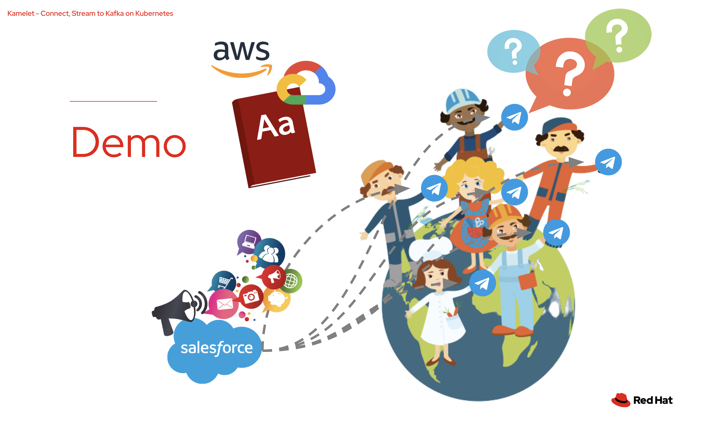
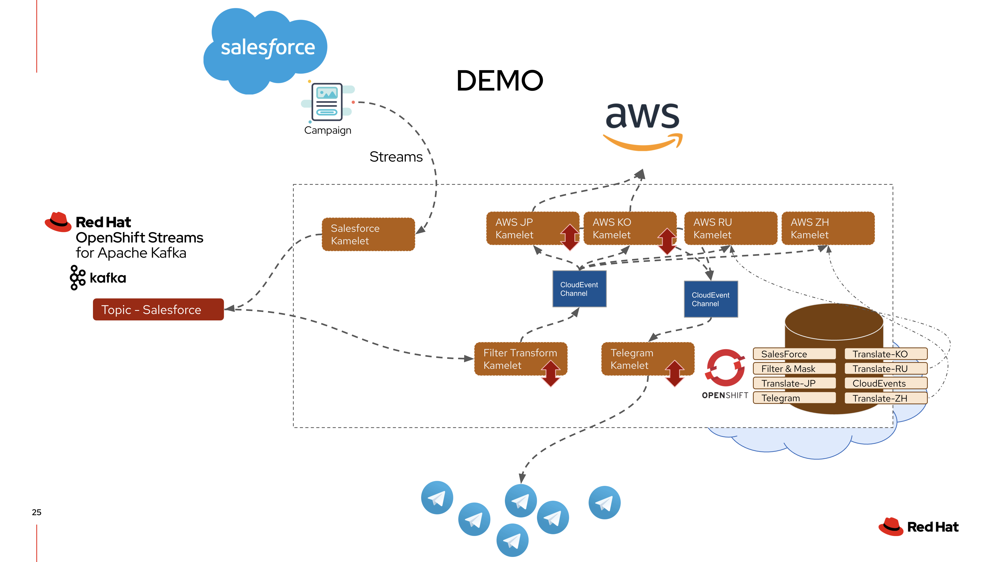
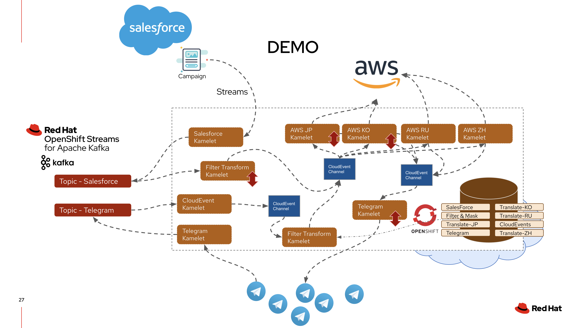

# Simple demo to introduce Kamelet

This demo will use Kamelet to stream campaign creation events from Salesforce to a Kafka topic hosted by Red Hat. And translate the campaign title into multiple languages using AWS translate service. Lastly pushing the campaign to the end audience on Telegram.  


[!Video(images/youtube.png)](https://www.youtube.com/watch?v=onOlnEdOhfM)


### Prerequisites

You will need access to a Kubernetes/OpenShift platform, since this is showing how amazing Kamelet is when it’s on k8s. You will also need to make sure 
- Camel K  
- Service Binding  
- OpenShift Serverless 
are installed on top of the container platform. 

And you will also need acess to the following environment. 

*Salesforce* : Get your credentials from setting the _Connected App_, you will need the Client Id, Client Secret, your login username/pwd. 
*Telegram* : Get your access token from fatherBot. 
*Red Hat OpenShift Streams*: Sign up a trial account: http://red.ht/TryKafka
*AWS*: Get your IAM credentials with access to translate service

## Installing the first scenario - Salesforce to CloudEvent (Serverless) for AWS translate and to Telegram



### Install Kamelets to your Marketplace on k8s or OpenShift

1. Create a new project `demo` 

```
oc new-project demo
```

2. Install all the Kamelet needed in the Marketplace. 

```
oc create -f aws-translate-action.kamelet.yaml
oc create -f filter-salesforce-kamelet.yaml
oc create -f filter-telegram-kamelet.yaml
oc create -f managed-kafka-source.kamelet.yaml
oc create -f managed-kafka-sink.kamelet.yaml
```


### Setup Kafka Cluster on Red Hat OpenShift Streams
1. Setup your cluster on *Red Hat OpenShift Streams* and create a topic called _salesforce-campaign_
2. Link your platform to the managed Kafka cluster using service binding. 

NOTE: Watch this video starting 17:30 https://www.youtube.com/watch?v=onOlnEdOhfM&t=1050s for step by step guidance 


### Create Kamelet Binding to run streaming instances on the platform

1. Add your Salesforce credentials to the _salesforce-to-managed-kafka.yaml_ and push it to your k8s/OpenShift platform
```
oc create -f salesforce-to-managed-kafka.yaml
```

2. Create three channels in the namespace.
- mychannel
- originaltxt
- translatedtxt

3. Convert events from Kafka to CloudEvents and also remove unused Salesforce data in the payload
```
oc create -f filter-salesforce-kamelet-binding.yaml
```

4. Create serverless function with Kamelets that streams cloudevents to external AWS translate service. First edit the two bind file with your AWS IAM credentials. And push them to k8s/OpenShift platform.

```
oc create -f aws-translate-binding-jp.yaml
oc create -f aws-translate-binding-ko.yaml
```

5. Create another serverless function with Kamelets that streams translated campaign to Telegram by pushing the Kamelet Binding to k8s/OpenShift platform. And don't forget to edit the _knative-to-telegram.yaml_ with your Telegram token and chatId. 

```
oc create -f knative-to-telegram.yaml
```

You are now ready to run the demo. See it in action 
https://www.youtube.com/watch?v=onOlnEdOhfM&t=944s


#### Bonus, adding two more translations. 
Create serverless function with Kamelets that streams cloudevents to external AWS translate service. Edit the two bind file with your AWS IAM credentials. And push them to k8s/OpenShift platform.

```
oc create -f aws-translate-binding-ru.yaml
oc create -f aws-translate-binding-tw.yaml
```


## Installing the second scenario - Direct translation on Telegram

Now I would like to translate everything on the telegram chatroom in realtime, so all member in the chat can understand each other. 



1. In your cluster on *Red Hat OpenShift Streams* create another topic called _telegram-in_
2. Streams all telegram chat to events and stored into Kafka cluster

```
oc create -f telegram-to-managed-kafka.yaml
```

3. Convert events from Kafka to CloudEvents, 
```
oc create -f managed-kafka-to-channel.yaml
```

4. Transform and extract campaign title from the telegram JSON style content 
```
oc create -f filter-telegram-kamelet-binding.yaml
```

And you can now type in telegram and see the direct real-time translation in the chatroom. 